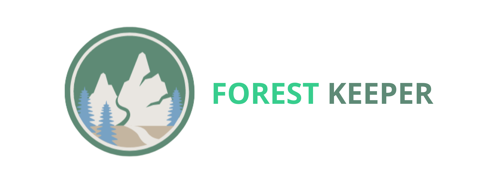

   
  
   
   

## 목차

1. [**서비스 소개**](#1)
2. [**UCC 보러가기**](#2)
3. [**프로젝트 기간**](#3)
4. [**팀원 소개**](#4)
5. [**기술 스택**](#5)
6. [**시스템 아키텍처**](#6)
7. [**주요 기능**](#8)
8. [**프로젝트 관련 문서**](#9)

  

## 💡 서비스 소개

### 등산과 플로깅의 만남, FOREST KEEPER

>  등산을 하며 나의 건강도 지키고, 
>  플로깅을 하며 지구의 건강도 지켜보세요 ! 

  

## 🎥 [UCC 보러가기]()

  

## 📆 프로젝트 기간

### 22.04.11 ~ 22.05.20

- 기획 및 설계 : 22.04.11 ~ 22.04.15
- 프로젝트 구현 : 22.04.18 ~ 22.05.19
- 버그 수정 및 산출물 정리 : 22.05.19 ~ 22.05.20

  

## 👪 팀원 소개

<table>
    <tr>
        <td height="140px" align="center"> <a href="https://github.com/gud_ejr">
                👑 염형덕  (Back-End) </a>  </td>
        <td height="140px" align="center"> <a href="https://github.com/">
                🙂 공윤환  (Back-End) </a>  </td>
        <td height="140px" align="center"> <a href="https://github.com/sumini97">
                😆 김수민  (Front-End) </a>  </td>
        <td height="140px" align="center"> <a href="https://github.com/yumin25">
                😁 김유민  (Back-End) </a>  </td>
        <td height="140px" align="center"> <a href="https://github.com/kibum414">
                🙄 박기범  (Back-End) </a>  </td>
        <td height="140px" align="center"> <a href="https://github.com/sangjinCHOI">
                😶 최상진  (Front-End) </a>  </td>
    </tr>
    <tr>
        <td align="center">REST API DATABASE</td>
        <td align="center">REST API</td>
        <td align="center">UI/UX</td>
        <td align="center">REST API SECURITY</td>
        <td align="center">REST API INFRA REDIS</td>
        <td align="center">UI/UX</td>
    </tr>
</table>

  

## 🛠️ 기술 스택

 

 

 

 

 <b> 상세 기술 스택 및 버전</b> 

| 범위                | 기술 스택            | 상세                | 버전                |
| ------------------ | ------------------ | ------------------ | ------------------ |
| **공통**            | 형상 관리            | Gitlab             |                    |
|                    | 이슈 관리            | Jira               |                    |
|                    | 커뮤니케이션          | Mattermost, Notion |                    |
| **BackEnd**        | Java               | OpenJDK            | 11.0.15            |
|                    | Spring             | Spring Boot        | 2.6.6              |
|                    |                    | Spring Security    |                    |
|                    |                    | Spring Data JPA    |                    |
|                    | DB                 | MySQL              | 8.0.28             |
|                    |                    | Redis              | 7.0.0              |
|                    | Cloud Storage      | AWS S3             |                    |
|                    | Build              | Gradle             | 7.4.1              |
|                    | API Docs           | Swagger            | 3.0.0              |
|                    | IDE                | IntelliJ           | 2022.01            |
| **FrontEnd**       | HTML5              |                    |                    |
|                    | CSS3               |                    |                    |
|                    | JavaScript(ES6)    |                    |                    |
|                    | React              | React              | 17.0.2             |
|                    | Redux              | 전역 상태 관리        | 4.2.0              |
|                    | IDE                | Visual Studio Code | 1.67.1             |
| **Server**         | 서버                | AWS EC2            |                    |
|                    | Linux 배포판        | Ubuntu             | 20.04.4            |
|                    | 배포                | Docker             | 20.10.15           |
| **DevOps**         | 배포                | Jenkins            |                    |

  

## 🗂️ 시스템 아키텍처

|                              시스템 아키텍처                       |
| :---------------------------------------------------------------------------: |
|    |

  

## 🖥️ 주요 기능

### 메인 화면
- 서비스를 둘러보고 apk를 다운받는다.

|                              메인화면                       |
| :---------------------------------------------------------------------------: |
|    |

 

### 회원가입 / 로그인
- 회원가입을 진행하고 로그인을 진행한다.

|                              회원가입                       |
| :---------------------------------------------------------------------------: |
|    |

|                              로그인                       |
| :---------------------------------------------------------------------------: |
|    |

 

### 플로깅
- 플로깅 결과를 저장하고 인증한다.

|                              플로깅 시작                       |
| :---------------------------------------------------------------------------: |
|    |

|                              플로깅 기록 확인                       |
| :---------------------------------------------------------------------------: |
|    |

|                              플로깅 인증                       |
| :---------------------------------------------------------------------------: |
|    |

|                              경험치 및 쓰레기 종류 확인                       |
| :---------------------------------------------------------------------------: |
|    |

 

### 산
- 산별 정보, 명예의 전당, 커뮤니티를 확인한다.

|                              메인 화면                       |
| :---------------------------------------------------------------------------: |
|    |

|                              산별 메인 화면                       |
| :---------------------------------------------------------------------------: |
|    |

|                              명예의 전당                       |
| :---------------------------------------------------------------------------: |
|    |

|                              커뮤니티 확인                       |
| :---------------------------------------------------------------------------: |
|    |

|                              커뮤니티 글 등록                       |
| :---------------------------------------------------------------------------: |
|    |

 

### 팀원 매칭
- 매칭 신청 및 등록한다.

|                              매칭 리스트 확인                       |
| :---------------------------------------------------------------------------: |
|    |

|                              매칭 신청                       |
| :---------------------------------------------------------------------------: |
|    |

|                              매칭 등록                       |
| :---------------------------------------------------------------------------: |
|    |

  

## 📋 프로젝트 관련 문서
|  구분  |  링크  |
| :--------------- | :---------------: |
| 기능 정의서 | [기능 정의서 바로가기](/docs/기능 정의서.md) |
| ERD | [ERD 바로가기](/docs/ERD.md) |
| 공통코드 | [공통코드 바로가기](/docs/공통코드.md) |
| 와이어프레임 | [와이어프레임 바로가기](/docs/와이어프레임.md) |
| 컨벤션 | [컨벤션 바로가기](/docs/컨벤션.md) |
| 포팅 매뉴얼 | [포팅 매뉴얼 바로가기](/exec/서울_3반_A306_포팅_매뉴얼.pdf) |
| 외부 서비스 정보 | [외부 서비스 정보 바로가기](/exec/서울_3반_A306_외부_서비스_정보.pdf) |
| 시연 시나리오 | [시연 시나리오 바로가기](/exec/서울_3반_A306_시연_시나리오.pdf) |
| 발표자료 | [발표자료 바로가기](/exec/서울_3반_A306_발표자료.pdf) |
